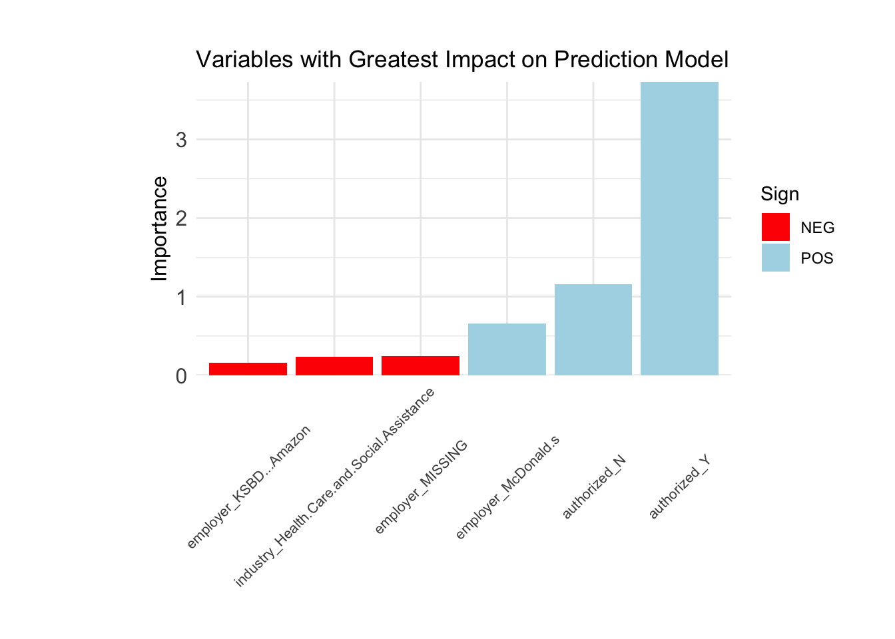

# Analyzing Labor Action Events: Predicting Strike Outcomes with R and Tidymodels

**Authors**: Putra Farrel Azhar, Lauryn Edwards, Meilin Chen, Yanji Wang   
**Published**: March 18, 2024   

---

## Table of Contents

1. [Introduction](#introduction)
2. [Data](#data)
3. [Model](#model)
4. [Conclusion](#conclusion)
5. [License](#license)

---

## Introduction

The focus of our project is to predict labor actions—specifically, whether they result in a strike or not. After evaluating various approaches, we selected the LASSO logistic regression model due to its strong performance. Our model achieved an accuracy rate of **92.79%** on the training set and a ROC AUC of **96.74%**, demonstrating effective classification of strike versus non-strike events. Testing on the latest data maintained an accuracy rate of **88.13%**. This report elaborates on our data handling, modeling processes, and performance evaluation. The final analysis script can be found [here](analysis/final_analysis/final_analysis.qmd). The following are the [.html](analysis/final_analysis/final_analysis.html) and [.pdf](analysis/final_analysis/final_analysis.pdf) version of the project's memo.

---

## Data

We utilized the Labor Action Tracker (LAT) dataset, supplemented with data from the American Community Survey (ACS) to enrich our analysis. Here’s an overview of our data processing steps:

1. **Data Cleaning**: 
   - Filtered LAT dataset for single-location labor actions and extracted longitude and latitude.
   - Converted U.S. county boundary shapefile to match our dataset’s coordinate reference system.
   - Spatially joined the datasets to associate labor actions with respective counties.

2. **Data Standardization**:
   - Created a binary variable for strikes (1 for "Strike", 0 for "Non-strike").
   - Standardized measurement units for labor action durations.
   - Removed redundant columns and ensured consistency in naming and formatting.

3. **Handling Missing Values**: 
   - Removed columns with excessive missing values.
   - Filled categorical variables with "Missing" and used median values for numeric variables with few missing entries.

---

## Model

After comparing several models (linear regression, KNN, and Random Forest), we found that logistic regression with LASSO performed best for our binary outcome prediction. Key aspects of our modeling process include:

- **Feature Selection**: LASSO's ability to shrink coefficients of less important variables to zero helps identify the most impactful predictors.
- **Parameter Tuning**: We conducted a 5-fold cross-validation to find the optimal penalty value, achieving the best model accuracy at **91.3%**.

### Performance Evaluation

The model's performance was assessed using a Confusion Matrix, indicating an impressive training accuracy of **92.8%**. When validated with the latest LAT dataset, the accuracy slightly decreased to **88.1%**, confirming the model's generalizability.

---

## Results

### Model Accuracy vs. Penalty

The figure above illustrates the relationship between the penalty and model accuracy, with error bars representing variability.

### Variable Importance

The figure highlights the variables with the greatest impact on the prediction model, categorized by their positive (POS) and negative (NEG) contributions.

---

## Conclusion

Despite challenges such as missing data and complex feature representations, our model effectively identifies the most significant predictors of labor actions. This information is crucial for employers and policymakers to implement proactive measures that address labor concerns before they escalate to strikes.

---

## License

This project is licensed under the MIT License. See the [LICENSE](LICENSE) file for details.

---

## Contributors

For inquiries or collaboration opportunities, please reach out to:

- [Farrel Azhar](https://www.linkedin.com/in/farrel-azhar-6b8179236/)
- [Lauryn Edwards](https://www.linkedin.com/in/lauryn-edwards-766aa218a/)
- [Calynn (Yanji) Wang](https://www.linkedin.com/in/calynn-yanji-wang/)
- [Meilin Cheng](https://www.linkedin.com/in/meilin-chen-864a6a292/)

